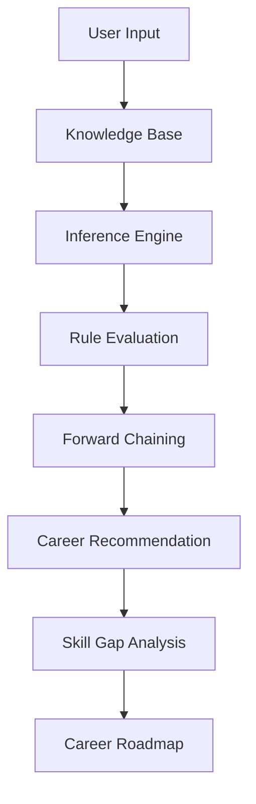
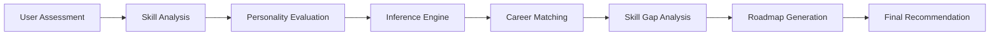

# 🚀 AI-Based Smart Career Counseling Expert System

<div align="center">

### 🧠 Intelligent Career Guidance Powered by Knowledge Representation & Reasoning (KRR)

<p>
An advanced AI-driven Expert System that analyzes user skills, interests, personality traits, strengths, and weaknesses to recommend the most suitable career path with explainable insights, skill-gap analysis, personalized roadmaps, and industry-focused guidance.
</p>

---

### ✨ Live Features


</div>

---

# 🌟 System Overview

The AI-Based Smart Career Counseling Expert System is an intelligent decision-support platform designed to help students and professionals discover the most suitable career paths using rule-based reasoning and expert knowledge.

The system evaluates:

✅ Skills & Technical Expertise

✅ Academic Background

✅ Personality Traits

✅ Strengths & Weaknesses

✅ Career Interests

✅ Domain Preferences

✅ Industry Demand

---

# 🎯 Core Features

<div align="center">

| Feature                  | Description                          |
| ------------------------ | ------------------------------------ |
| 🤖 Career Recommendation | AI-generated career suggestions      |
| 📊 Match Percentage      | Compatibility score calculation      |
| 🧠 Explainable AI        | Transparent recommendation reasoning |
| 📈 Skill Gap Analysis    | Missing skills identification        |
| 🛣️ Career Roadmap       | Step-by-step growth plan             |
| 👤 Personality Analysis  | Trait-based evaluation               |
| ⚠️ Weakness Analysis     | Areas for improvement                |
| 🎯 Domain Filtering      | Career-specific filtering            |
| 💰 Salary Insights       | PKR & USD salary estimates           |
| 📜 Certifications Guide  | Recommended certifications           |
| 💼 Job Roles Explorer    | Industry role suggestions            |
| 🌙 Modern Dark Theme     | Premium Streamlit Interface          |

</div>

---

# 🧠 Knowledge Representation & Reasoning (KRR)

<div align="center">



</div>

---

# ⚡ AI Reasoning Architecture

### Knowledge Base

Stores expert career knowledge, requirements, skills, and industry mappings.

### Inference Engine

Applies intelligent reasoning over user profiles using weighted rules.

### Forward Chaining

Automatically derives recommendations from available facts.

### Rule-Based Expert System

Uses IF-THEN logic to simulate expert-level career counseling.

Example:

```python
IF
    Programming >= High
    AND Problem Solving >= High
    AND AI Interest = True

THEN
    Recommend AI Engineer
```

---

# 🎓 Supported Career Domains

<div align="center">

| Career Path             | Industry                |
| ----------------------- | ----------------------- |
| 🤖 AI Engineer          | Artificial Intelligence |
| 📊 Data Scientist       | Data Analytics          |
| 💻 Software Engineer    | Software Development    |
| 🔐 Cybersecurity Expert | Information Security    |
| 🎨 Graphic Designer     | Creative Design         |
| 📈 Business Analyst     | Business Intelligence   |
| 🗂️ Project Manager     | Project Management      |
| 🌐 Network Engineer     | Networking              |
| 🦾 Robotics Engineer    | Robotics & Automation   |
| 🎮 Game Developer       | Game Development        |

</div>

---

# 📈 Recommendation Workflow



---

# 🎨 Modern UI Highlights

✨ Animated Dashboard

✨ Interactive Charts

✨ Glassmorphism Components

✨ Dark Cyber Theme

✨ Responsive Layout

✨ Professional Data Visualization

✨ Smooth Transitions

✨ Career Insight Cards

✨ Progress Indicators

✨ Dynamic Recommendations

---

# 📊 Output Example

### Recommended Career

🤖 AI Engineer

### Match Score

95%

### Skill Gaps

* Deep Learning
* MLOps
* LLM Development

### Recommended Certifications

* Google Machine Learning Engineer
* IBM AI Engineering
* DeepLearning.AI Specialization

### Estimated Salary

🇵🇰 PKR 250,000 – 700,000 / Month

🇺🇸 USD 80,000 – 180,000 / Year

---

# 🛠 Technology Stack

```yaml
Frontend:
  - Streamlit
  - HTML/CSS
  - JavaScript

Backend:
  - Python

AI Logic:
  - Knowledge Base
  - Rule Engine
  - Forward Chaining

Visualization:
  - Plotly
  - Streamlit Charts

Deployment:
  - Streamlit Cloud
  - GitHub
```

---

# 🚀 Future Enhancements

* LLM-Based Career Advisor
* Resume Analyzer
* AI Interview Preparation
* Job Market Trend Analysis
* Learning Path Generator
* Real-Time Job Recommendations
* LinkedIn Profile Assessment
* Multi-Language Support

---

<div align="center">

### ⭐ Intelligent Career Guidance Through Explainable AI

Built with ❤️ using Python, Streamlit, and Knowledge Representation & Reasoning

</div>
